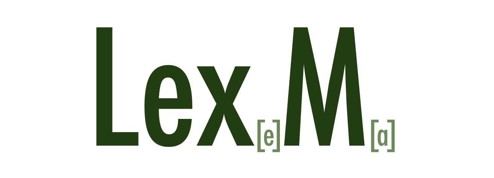

<div align="center">



### Lemma Markup Format


</div>

---

LexM is a concise, human-readable format for representing dictionary-ready lexical entries with their various forms, relationships, and redirections. It's designed to be both easy to write by hand and simple to parse programmatically.

## Installation

Add this line to your application's Gemfile:

```ruby
gem 'lexm'
```

And then execute:

```bash
$ bundle install
```

Or install it yourself as:

```bash
$ gem install lexm
```

## Basic Format

A LexM entry consists of a lemma (headword) and optional elements:

```
lemma[annotations]|sublemma1,sublemma2,>(relation)target
```

> [!NOTE]
> The format is designed to be human-readable while still being structured enough for programmatic processing. This makes it ideal for dictionary development, computational linguistics, and language learning applications.

## Examples

```ruby
require 'lexm'
include LexM

# Create a lemma with annotations
lemma = Lemma.new("rise[sp:rose,pp:risen]")
puts lemma
# => rise[sp:rose,pp:risen]

# Create a lemma with sublemmas
lemma = Lemma.new("abandon|abandoned,abandonment")
puts lemma
# => abandon|abandoned,abandonment

# Create a redirection entry
lemma = Lemma.new("better>>(cmp)good")
puts lemma
# => better>>(cmp)good

# Create a lemma with a redirection sublemma
lemma = Lemma.new("rose|>(sp)rise")
puts lemma
# => rose|>(sp)rise

# Build a lemma programmatically
lemma = Lemma.new
lemma.text = "run"
lemma.setAnnotations({"sp" => "ran", "pp" => "run"})
lemma.addSublemmas(["run away", "run up"])
puts lemma
# => run[sp:ran,pp:run]|run away,run up

# Work with a collection of lemmas
list = LemmaList.new
list.addLemma(Lemma.new("go[sp:went,pp:gone]|go about,go ahead"))
list.addLemma(Lemma.new("better>>(cmp)good"))

# Find lemmas that redirect to "good"
good_redirects = list.findRedirectionsTo("good")

# Iterate through all words
list.eachWord do |word|
    puts "Word: #{word}"
end
```

> [!TIP]
> When using `addLemma`, the method will automatically merge lemmas with the same headword by default, combining their annotations and adding new sublemmas. Use `addLemma(lemma, false)` to add a lemma without merging.

## Entry Types

### Standard Lemma

A standard dictionary entry with a headword and optional annotations:

```
run[sp:ran,pp:run]
```

### Lemma with Sublemmas

A headword with related forms or expressions:

```
abandon|abandoned,abandonment
```

### Redirection Entry

A pure redirection that points to another lemma:

```
better>>(cmp)good
```

### Mixed Format

A lemma that has sublemmas including a redirection:

```
left|left-handed,>(sp,pp)leave
```

## Advanced Features

### Validation

LexM includes comprehensive validation to ensure your dictionary data is consistent and free of conflicts:

```ruby
list = LemmaList.new
# Add lemmas...

# Option 1: Validates and returns true/false
if list.validate
  puts "Dictionary is valid!"
else
  puts "Dictionary contains errors"
end

# Option 2: Get a list of all validation errors
errors = list.validateAll
if errors.empty?
  puts "Dictionary is valid!"
else
  puts "Validation errors:"
  errors.each { |error| puts "- #{error}" }
end
```

> [!IMPORTANT]
> The `validateAll` method checks for all validation issues at once, including:
> - Duplicate headwords
> - Words that appear as both headwords and sublemmas
> - Words that appear as both normal headwords and redirection headwords
> - Circular dependencies and redirections

### File Operations

Load from and save to LexM files:

```ruby
# Load from file
lemmas = LemmaList.new("dictionary.lexm")

# Save to file
lemmas.save("updated_dictionary.lexm")
```

## LexM Format Specification

| Element | Syntax | Example |
|---------|--------|---------|
| Lemma | `word` | `run` |
| Annotations | `[key:value,key2:value2]` | `[sp:ran,pp:run]` |
| Sublemmas | `\|sublemma1,sublemma2` | `\|run away,run up` |
| Redirection | `>>(type)target` | `>>(pl)child` |
| Sublemma Redirection | `\|>(type)target` | `\|>(sp)rise` |

## Attribution
LexM was created and developed by Yanis Zafirópulos (a.k.a. Dr.Kameleon). If you use this software, please maintain this attribution.

### How to Cite
If you use LexM in your research or applications, please cite it as:

> Yanis Zafirópulos (2025). "LexM: Lemma Markup Format." GitHub repository: https://github.com/drkameleon/lexm

## License

This library is available as open source under the terms of the [MIT License](https://opensource.org/licenses/MIT).